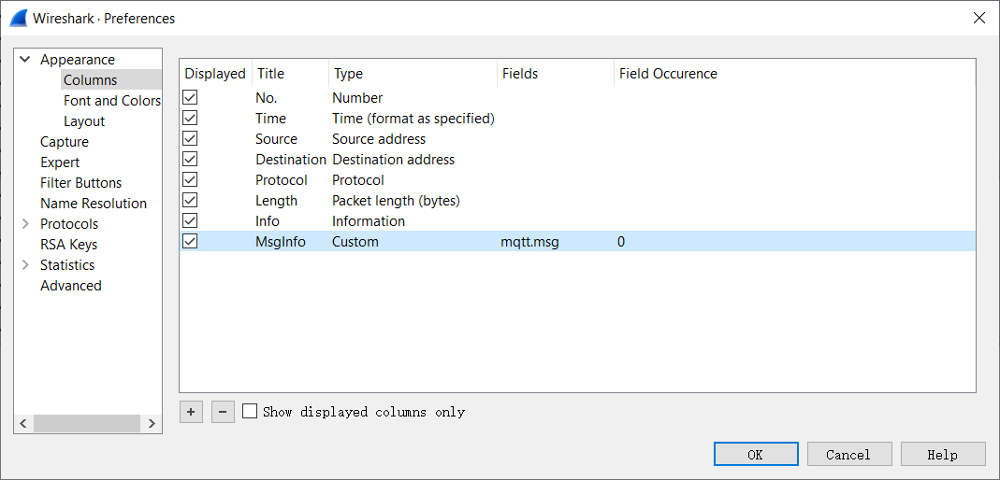

# Process

## Contents

- [Process](#process)
  - [Contents](#contents)
  - [Goal](#goal)
  - [AWS IoT is not a good choice](#aws-iot-is-not-a-good-choice)
    - [About AWS IoT](#about-aws-iot)
    - [Why not use it](#why-not-use-it)
  - [Environment](#environment)
    - [1. MQTT Broker](#1-mqtt-broker)
    - [2. MQTT Client 1 (Publisher)](#2-mqtt-client-1-publisher)
    - [3. MQTT Client 2 (Subscriber)](#3-mqtt-client-2-subscriber)
  - [Testing process](#testing-process)
    - [Create Broker](#create-broker)
    - [Configure publisher and subscriber](#configure-publisher-and-subscriber)
    - [Ensure time synchronization](#ensure-time-synchronization)
    - [Test and capture data](#test-and-capture-data)
    - [Process captured data](#process-captured-data)
  - [Python script for processing Wireshark](#python-script-for-processing-wireshark)
  - [Data at a glance](#data-at-a-glance)
  - [Data Summary](#data-summary)
  - [Answers for Questions](#answers-for-questions)
    - [Describe the messages that are exchanged between devices and broker](#describe-the-messages-that-are-exchanged-between-devices-and-broker)
      - [QoS 0](#qos-0)
      - [QoS 1](#qos-1)
      - [QoS 2](#qos-2)
    - [How does quality affect latency? Why?](#how-does-quality-affect-latency-why)

## Goal

Test MQTT traffic

## AWS IoT is not a good choice

### About AWS IoT

Message Broker for AWS IoT
| Protocol | Authentication           | Port | ALPN Protocol Name |
| -------- | ------------------------ | ---- | ------------------ |
| MQTT     | X.509 client certificate | 8883 | N/A                |
AWS IOT ONLY SUPPORT QoS Level 0 AND 1
Use [AWS IoT SDK for Python v2](https://github.com/aws/aws-iot-device-sdk-python-v2) for device to connect to AWS Iot Core

### Why not use it

- AWS IoT MQTT always enables TLS Encryption so it's difficult to track latency of MQTT message by using Wireshark after try.
- In Wireshark, there is only info about the TLS packet. Even I can use packet length to find out those data packet, some problems will occur when there is packet loss.
- When there is packet loss sometimes publisher would send multiple temperature data in one TLS packet. So it's unavailable to test and evaluate MQTT latency through AWS IoT.

## Environment

### 1. MQTT Broker

Ubuntu 18.04 LTS (AWS EC2 Instance: t2.micro 1GB RAM)
Domain: ec2-3-81-217-129.compute-1.amazonaws.com
mosquitto version 1.6.8

### 2. MQTT Client 1 (Publisher)

Ubuntu 18.04 LTS Name: Client (Virtual Machine in Virtual Box 6.1)
Local IP behind NAT: 10.0.2.4
mosquitto_pub version 1.4.15 running on libmosquitto 1.4.15

### 3. MQTT Client 2 (Subscriber)

Ubuntu 18.04 LTS Name: Server (Virtual Machine in Virtual Box 6.1)
Local IP behind NAT: 10.0.2.15
mosquitto_sub version 1.4.15 running on libmosquitto 1.4.15

## Testing process

### Create Broker

1. Get an aws educate account by using NEU e-mail account
2. Use aws educate account to get into aws console to create a simple EC2 instance with Ubuntu 18.04 LTS
3. Install mosquitto:

    ```shell
    sudo apt install mosquitto
    ```

4. After install mosquitto will automatically run in background on port 1883

### Configure publisher and subscriber

1. Install mosquitto clients on two local Ubuntu

    ```shell
    sudo apt install mosquitto-clients
    ```

### Ensure time synchronization

1. Install tools for time synchronization and checking time difference on two local Ubuntu

    ```shell
    sudo apt install clockdiff ntpdate
    ```

    **clockdiff**: check time difference with target host machine by using ICMP
    **ntpdate**: synchronize with specified ntp server

2. Synchronize the time of two machine
   1. Synchronize time with one same ntp server, run following code on two Ubuntu:

        ```shell
        sudo ntpdate -u time.google.com
        ```

   2. Check time difference with each other on both Ubuntu

        ```shell
        # on Publisher
        client@client-VirtualBox:~/assignment3$ clockdiff  10.0.2.15
        .....
        host=10.0.2.15 rtt=237(295)ms/0ms delta=0ms/0ms Sun Mar 29 00:46:10 2020
        # on Subscriber
        server@server-VirtualBox:~/assignment3$ clockdiff   10.0.2.4
        .
        host=10.0.2.4 rtt=750(187)ms/0ms delta=0ms/0ms Sun Mar 29 00:42:07 2020
        ```

### Test and capture data

1. Run Wireshark on both Ubuntu
2. Subscriber subscribe topic 'temperature' on broker

    ```shell
    mosquitto_sub -h ec2-3-81-217-129.compute-1.amazonaws.com -t tempreture -q 0
    ```

3. Publisher publish 1000  msg to topic 'temperature' from '0C' to '999C' by creating a shell:

    ```shell
    #!/bin/bash
    for ((i=0;i<1000;i++))
    do
        msg=${i}C
        mosquitto_pub -h ec2-3-81-217-129.compute-1.amazonaws.com -t tempreture -m $msg -q 0
        echo "Sent msg:[$msg]"
    done
    ```

4. Save Wireshark data in .pcapng format
5. Repeat 4-6 steps with changing QoS level setting by edit the '-q' option to '-q 0|1|2'

### Process captured data

1. Add a column of mqtt.msg in Wireshark so as to export msg data into csv files with data of mqtt.msg
    
2. Process data by writing a python script

## Python script for processing Wireshark

Import packages

```python
from csv import DictReader
from os import chdir
from binascii import a2b_hex
```

Set filter strings

```python
pub_ip = '10.0.2.4'
sub_ip = '10.0.2.15'
broker_ip = '3.81.217.129'
msg_str = '[tempreture]'
```

Change work path
Set publisher and subscriber data path

```python
work_path = '\\data'
chdir(work_path)
pub_data_path = '.\\pub2\\'
sub_data_path = '.\\sub2\\'
```

Set publisher data files' path

```python
pub_qos0_path = pub_data_path+ 'qos0\\'
pub_qos1_path = pub_data_path+ 'qos1\\'
pub_qos2_path = pub_data_path+ 'qos2\\'

pub_qos0_0_path = pub_qos0_path + '1000_0loss.csv'
pub_qos0_5_path = pub_qos0_path + '1000_5loss.csv'
pub_qos0_10_path = pub_qos0_path + '1000_10loss.csv'

pub_qos1_0_path = pub_qos1_path + '1000_0loss.csv'
pub_qos1_5_path = pub_qos1_path + '1000_5loss.csv'
pub_qos1_10_path = pub_qos1_path + '1000_10loss.csv'

pub_qos2_0_path = pub_qos2_path + '1000_0loss.csv'
pub_qos2_5_path = pub_qos2_path + '1000_5loss.csv'
pub_qos2_10_path = pub_qos2_path + '1000_10loss.csv'
```

Set subsriber data files' path

```python
sub_qos0_path = sub_data_path+ 'qos0\\'
sub_qos1_path = sub_data_path+ 'qos1\\'
sub_qos2_path = sub_data_path+ 'qos2\\'

sub_qos0_0_path = sub_qos0_path + '1000_0loss.csv'
sub_qos0_5_path = sub_qos0_path + '1000_5loss.csv'
sub_qos0_10_path = sub_qos0_path + '1000_10loss.csv'

sub_qos1_0_path = sub_qos1_path + '1000_0loss.csv'
sub_qos1_5_path = sub_qos1_path + '1000_5loss.csv'
sub_qos1_10_path = sub_qos1_path + '1000_10loss.csv'

sub_qos2_0_path = sub_qos2_path + '1000_0loss.csv'
sub_qos2_5_path = sub_qos2_path + '1000_5loss.csv'
sub_qos2_10_path = sub_qos2_path + '1000_10loss.csv'
```

Function for process csv data:

- Data of QoS level 1 or 2
- Data of Qos level 0 with no packet loss

```python
def qos_csv_reader(csv_path_str, source_ip, dest_ip, contains_info):
    latency_array = []
    with open(csv_path_str, newline='') as csvfile:
        reader = DictReader(csvfile)
        for row in reader:
            if (source_ip in row['Source']) and (dest_ip in row['Destination'] and ('MQTT' == row['Protocol'])):
                for i in range(row['Info'].count(contains_info)):
                    latency_array.append(float(row['Time']))
                # When packet loss occurs with QoS 0, publisher will lose its mqtt publish msg
                # and show info as '[TCP Previous segment not captured] , Disconnect Req'
                if '[TCP Previous segment not captured]' in row['Info']:
                    latency_array.append(float(row['Time']))
#     print(csv_path_str + ' : ' + str(len(latency_array)))
    return latency_array
```

Function for get temperature value from hex string
eg: '41404043' -> '100C' -> 100

```python
def get_tempreture_num( msg_str ):
    return int(a2b_hex(msg_str.encode()).decode()[:-1])
```

Function for process csv data:

- Data of Qos level 0 with packet loss which has mqtt.msg field

Because **QoS 0 with packet loss will cause subscribed or published msgs arranged in the wrong order**

```python
def qos0_loss_csv_reader(csv_path_str, source_ip, dest_ip, contains_info):
    res_dict = {}
    lost_timestamps = []
    lost_index = [i for i in range(1000)]
    with open(csv_path_str, newline='') as csvfile:
        reader = DictReader(csvfile)
        last_tempreture_num = 0
        for row in reader:
            if (source_ip in row['Source']) and (dest_ip in row['Destination'] and ('MQTT' == row['Protocol'])):
                msg_num = row['Info'].count(contains_info)
                info = row['MsgInfo']
                if msg_num > 1:
                    info_arr = info.split(',')
                    if(len(info_arr)==msg_num):
                        for hex_str in info_arr:
                            index = get_tempreture_num(hex_str)
                            res_dict.setdefault(index,float(row['Time']))
                            lost_index.remove(index)
                    else:
                        print("error!")
                elif msg_num == 1:
                    index = get_tempreture_num(info)
                    res_dict.setdefault(index,float(row['Time']))
                    lost_index.remove(index)
                elif '[TCP Previous segment not captured]' in row['Info']:
                    lost_timestamps.append(float(row['Time']))
    if len(lost_index) == len(lost_timestamps) and len(lost_timestamps) > 0:
        for index, timestamp in zip(lost_index, lost_timestamps):
            res_dict.setdefault(index, timestamp)
    res_dict = sorted(res_dict.items())
    latency_array = [b for a,b in res_dict ]
#     print(csv_path_str + ' : ' + str(len(latency_array)))
    return latency_array
```

Process publisher data to get timestamp lists for each case

```python
pub_qos0_0_data = qos_csv_reader(pub_qos0_0_path, pub_ip, broker_ip, msg_str)
pub_qos0_5_data = qos0_loss_csv_reader(pub_qos0_5_path, pub_ip, broker_ip, msg_str)
pub_qos0_10_data = qos0_loss_csv_reader(pub_qos0_10_path, pub_ip, broker_ip, msg_str)

pub_qos1_0_data = qos_csv_reader(pub_qos1_0_path, pub_ip, broker_ip, msg_str)
pub_qos1_5_data = qos_csv_reader(pub_qos1_5_path, pub_ip, broker_ip, msg_str)
pub_qos1_10_data = qos_csv_reader(pub_qos1_10_path, pub_ip, broker_ip, msg_str)

pub_qos2_0_data = qos_csv_reader(pub_qos2_0_path, pub_ip, broker_ip, msg_str)
pub_qos2_5_data = qos_csv_reader(pub_qos2_5_path, pub_ip, broker_ip, msg_str)
pub_qos2_10_data = qos_csv_reader(pub_qos2_10_path, pub_ip, broker_ip, msg_str)
```

Process subsriber data to get timestamp lists for each case

```python
sub_qos0_0_data = qos_csv_reader(sub_qos0_0_path, broker_ip, sub_ip, msg_str)
sub_qos0_5_data = qos0_loss_csv_reader(sub_qos0_5_path, broker_ip, sub_ip, msg_str)
sub_qos0_10_data = qos0_loss_csv_reader(sub_qos0_10_path, broker_ip, sub_ip, msg_str)

sub_qos1_0_data = qos_csv_reader(sub_qos1_0_path, broker_ip, sub_ip, msg_str)
sub_qos1_5_data = qos_csv_reader(sub_qos1_5_path, broker_ip, sub_ip, msg_str)
sub_qos1_10_data = qos_csv_reader(sub_qos1_10_path, broker_ip, sub_ip, msg_str)

sub_qos2_0_data = qos_csv_reader(sub_qos2_0_path, broker_ip, sub_ip, msg_str)
sub_qos2_5_data = qos_csv_reader(sub_qos2_5_path, broker_ip, sub_ip, msg_str)
sub_qos2_10_data = qos_csv_reader(sub_qos2_10_path, broker_ip, sub_ip, msg_str)
```

Function for calculate latency

```python
def calculate_latency(pub_time_arr, sub_time_arr):
    avg_res = 0
    native_case_num = 0
    index = 0
    if len(pub_time_arr) == len(sub_time_arr):
        latency_arr = []
        for pub,sub in zip(pub_time_arr,sub_time_arr):
            if (sub - pub) > 0:
                latency_arr.append(sub-pub)
            else:
                print("%d : %f - %f" % (index, sub, pub))
                native_case_num += 1
            index += 1
        avg_res = sum(latency_arr)/len(latency_arr)
    else:
        print("Length of input lists are not equal！")
    if native_case_num > 0:
        print("Native latency orrcurs %d times!" % native_case_num)
    return avg_res
```

Get latency result of each case

```python
print("Qos 0 with 0%%  packet loss latency: %f s" % calculate_latency(pub_qos0_0_data,sub_qos0_0_data))
print("Qos 0 with 5%%  packet loss latency: %f s" % calculate_latency(pub_qos0_5_data,sub_qos0_5_data))
print("Qos 0 with 10%% packet loss latency: %f s" % calculate_latency(pub_qos0_10_data,sub_qos0_10_data))

print("Qos 1 with 0%%  packet loss latency: %f s" % calculate_latency(pub_qos1_0_data,sub_qos1_0_data))
print("Qos 1 with 5%%  packet loss latency: %f s" % calculate_latency(pub_qos1_5_data,sub_qos1_5_data))
print("Qos 1 with 10%% packet loss latency: %f s" % calculate_latency(pub_qos1_10_data,sub_qos1_10_data))

print("Qos 2 with 0%%  packet loss latency: %f s" % calculate_latency(pub_qos2_0_data,sub_qos2_0_data))
print("Qos 2 with 5%%  packet loss latency: %f s" % calculate_latency(pub_qos2_5_data,sub_qos2_5_data))
print("Qos 2 with 10%% packet loss latency: %f s" % calculate_latency(pub_qos2_10_data,sub_qos2_10_data))
```

## Data at a glance

| Packet loss (%) | Qos 0  (s) | Qos 1  (s) | Qos 2 (s) |
| --------------- | ---------- | ---------- | --------- |
| 0               | 0.068281   | 0.067730   | 0.137305  |
| 5               | 0.099493   | 0.068319   | 0.155797  |
| 10              | 0.119493   | 0.068085   | 0.185261  |

## Data Summary

1. Packet loss caused some of msgs under QoS 0 disordered both on subscriber and publisher.
2. Packet loss caused the obvious proportional increase of latency under QoS 0.
3. QoS 1 Level communication under packet loss maintains stable and less latency than all other QoS level.
4. QoS 2 level communication under packet loss caused small proportional increase on latency and has more stable latency then QoS 0 has.

## Answers for Questions

### Describe the messages that are exchanged between devices and broker

No matter which level of QoS, the device firstly establish the TCP connect with broker then:

#### QoS 0

- Publisher
   1. Sent **Connect Command** to broker to connect
   2. Get **Connect Ack**, which means connection established
   3. Publish msg to topic, which contains topic name and msg data
   4. Sent **Disconnect Req** to disconnect
- Subscriber
   1. Establish connection and subscribe to a topic at QoS 2 level
      1. Sent **Connect Command** to broker to connect
      2. Get **Connect Ack**, which means connection established
      3. Sent **Subscribe Request** with id
      4. Get **Subscribe Ack** with id, means the success of subscribe
   2. Begin to get **Publish Msg** which contains msg data

#### QoS 1

- Publisher
   1. Sent **Connect Command** to broker to connect
   2. Get **Connect Ack**, which means connection established
   3. Publish msg to topic with a id, which contains topic name and msg data
   4. Get **Publish Ack** with id
   5. Sent **Disconnect Req** to disconnect
- Subscriber
   1. Establish connection and subscribe to a topic at QoS 2 level
      1. Sent **Connect Command** to broker to connect
      2. Get **Connect Ack**, which means connection established
      3. Sent **Subscribe Request** with id
      4. Get **Subscribe Ack** with id, means the success of subscribe
   2. Begin to get **Publish Msg** which contains topic name, msg data and a id
   3. Sent **Publish Ack** with a id to broker
   4. *Id increases by 1 each time a message is received*

#### QoS 2

- Publisher
   1. Sent **Connect Command** to broker to connect
   2. Get **Connect Ack**, which means connection established
   3. Publish msg to topic with a id, which contains topic name and msg data
   4. Get **Publish Ack** with id
   5. Sent **Publish Release** to notice the end of publish
   6. Get **Publish Complete**, which means publish is completed
   7. Sent **Disconnect Req** to disconnect
- Subscriber
   1. Establish connection and subscribe to a topic at QoS 2 level
      1. Sent **Connect Command** to broker to connect
      2. Get **Connect Ack**, which means connection established
      3. Sent **Subscribe Request** with id
      4. Get **Subscribe Ack** with id, means the success of subscribe
   2. Begin to get **Publish Msg** which contains topic name, msg data and a id
   3. Sent **Publish Ack** with a id to broker
   4. Get **Publish Release** with a id, know that publish is completed
   5. Sent **Publish Complete** with a id to acknowledge publish has completed
   6. *Id increases by 1 each time a message is received*

### How does quality affect latency? Why?

- Because QoS 0 has no checking mechanism so when there is packet loss, the broker would not notice that until the publisher found there is packet loss by checking the ACK number in TCP header and then resend the TCP packet. Such wait then resend process obviously increase the latency.
- Because QoS 1 is at least once, so broker just has to check it has received the msg and no matter to check the redundancy, so when the packet from publisher lost, the broker will immediately detect the loss and notice the publisher to resend the message. Although the *Acknowledgment of Publish* increases the latency, such mechanism ensures the stable of latency to face the packet loss.
- Because QoS 2 not only has to acknowledge the Publish but also has to make sure the times of published msg by using ID and an extra *handshake*, such mechanism substantially increases the number of interactions of once publish process, which not only increase the time cost of once publish process( increase latency as result) but also increase more lost packets( also causes the rise of latency).